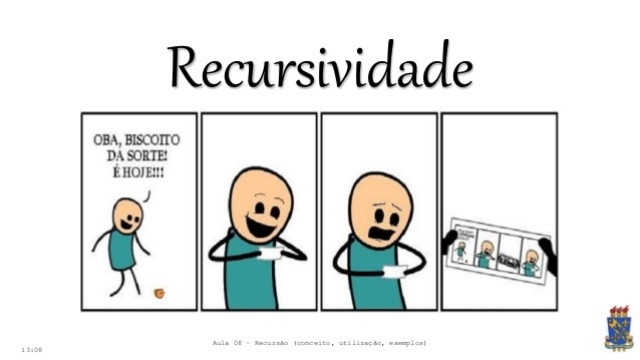

## L1 - {robot} vector rec



Leia um vetor de inteiros e implemente as funções sem utilizar laço para iterar sobre os elementos. 

Você pode utilizar laço para ler os elementos do vetor.

___

- Entrada
    - um vetor de inteiros. O vetor tem no mínimo 1 elemento.
- Saída
    - vet: o vetor
    - rvet: o vetor impresso ao contrário
    - sum: a soma dos elementos
    - mult: a multiplicação dos elementos
    - min: o menor elemento
    - inv: inverte o vetor, depois imprime ele invertido


___
## Help

Em C e C++, pode ler a entrada de dados dessa forma. Ele vai ler inteiros até chegar ao final do arquivo de entrada. Se tiver digitando os valores utilize:

- Linux(Enter + Ctrl D)
- Windows (Ctrl Z)

para enviar um sinal de fim de arquivo. 

### C
```c
//c
int vet[1000];
int size = 0;
int value = 0;
//enquanto conseguir ler valores antes de chegar no fim do arquivo
while(scanf("%d", &value) > 0) 
    vet[size++] = value;
```

### C++
```cpp
#include <sstream> //stringstream

string line;
getline(cin, line);
stringstream ss(line);
vector<int> vet;
int value;
while(ss >> value)
    vet.push_back(value);
```

___

## Testes

```
>>>>>>>> 01
4
========
vet : [ 4 ]
rvet: [ 4 ]
sum : 4
mult: 4
min : 4
inv : [ 4 ]
<<<<<<<<

>>>>>>>> 02
3 4 2
========
vet : [ 3 4 2 ]
rvet: [ 2 4 3 ]
sum : 9
mult: 24
min : 2
inv : [ 2 4 3 ]
<<<<<<<<

>>>>>>>> 03
1 2 3 4
========
vet : [ 1 2 3 4 ]
rvet: [ 4 3 2 1 ]
sum : 10
mult: 24
min : 1
inv : [ 4 3 2 1 ]
<<<<<<<<

>>>>>>>> 04
1 2 3 4 0
========
vet : [ 1 2 3 4 0 ]
rvet: [ 0 4 3 2 1 ]
sum : 10
mult: 0
min : 0
inv : [ 0 4 3 2 1 ]
<<<<<<<<

>>>>>>>> 05
1 2 3 4 2 3
========
vet : [ 1 2 3 4 2 3 ]
rvet: [ 3 2 4 3 2 1 ]
sum : 15
mult: 144
min : 1
inv : [ 3 2 4 3 2 1 ]
<<<<<<<<

>>>>>>>> 06
1 2 3 4 7 2 9
========
vet : [ 1 2 3 4 7 2 9 ]
rvet: [ 9 2 7 4 3 2 1 ]
sum : 28
mult: 3024
min : 1
inv : [ 9 2 7 4 3 2 1 ]
<<<<<<<<

>>>>>>>> 07
0 1 2 3 -4 -7 -2
========
vet : [ 0 1 2 3 -4 -7 -2 ]
rvet: [ -2 -7 -4 3 2 1 0 ]
sum : -7
mult: 0
min : -7
inv : [ -2 -7 -4 3 2 1 0 ]
<<<<<<<<

```
