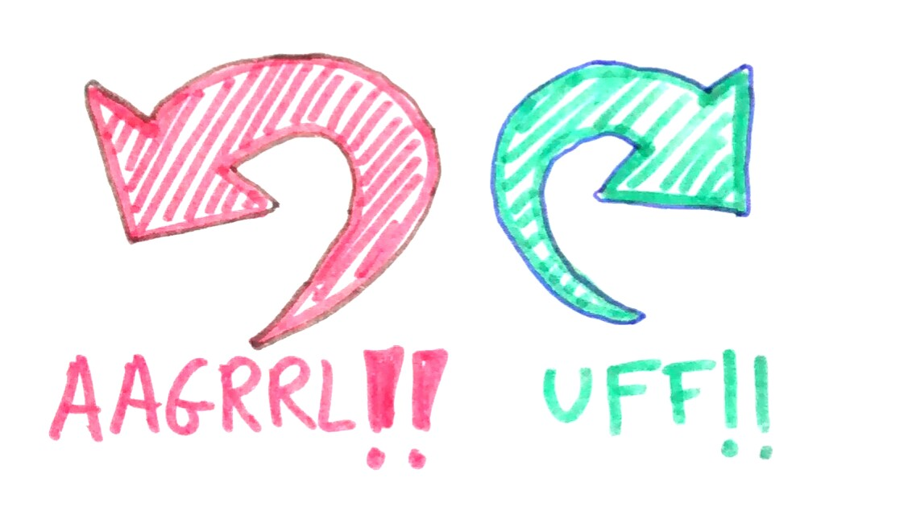

## L4 - undo redo



Implementar um editor de texto simplificado que receba os seguintes valores como
entrada.

- Os caracteres minúsculos "abc...z" e "-" são compreendidas como texto.
- O cursor deve ser mostrado com o char |
- Os seguintes caracteres serão comandos.
    - __Parte 1__ - Movimentação de Cursor
        * "R" return, insere o Enter.
        * "B" backspace, apaga o caractere atrás do cursor, se houver.
        * "D" delete, apaga o caractere na frente do cursor, se houver.
        * ">" move o cursor para direita, se for possível.
        * "<" move o cursor para esquerda, se for possível.
    - __Parte 2__ - Fila de ações.
        * "Z" Desfazer, desfaz a inserção ou remoção.
        * "Y" Refazer, refaz a última inserção ou remoção.


## Testes da parte 1

```
>>>>>>>>
abc
========
abc|
<<<<<<<<

>>>>>>>>
euRteRamo
========
eu
te
amo|
<<<<<<<<

>>>>>>>>
euRamo<<<
========
eu
|amo
<<<<<<<<

>>>>>>>>
euRamo<<<<<<<como-
========
como-|eu
amo
<<<<<<<<


>>>>>>>>
euRemo<<Ba>>>>>>
========
eu
amo|
<<<<<<<<

>>>>>>>>
voc-ae<<v<<e>>>Di>
========
voce-vai|
<<<<<<<<
```

## Parte II

Se você implementar a **Parte 2** o undo e o redo funcionam como no seu editor. 
Apenas dados geram novos estados. Movimentar não. Vamos processar passo a passo o comandos no passo a passo dos testes

```
>>>>>>>>
eu-te-amoB
========
eu-te-am|
<<<<<<<<

>>>>>>>>
eu-te-amoBZ
========
eu-te-amo|
<<<<<<<<

>>>>>>>>
eu-te-amoBZ<<braco
========
eu-te-abraco|mo
<<<<<<<<

>>>>>>>>
abcZZd
========
ad|
<<<<<<<<

>>>>>>>>
abcZZYd
========
abd|
<<<<<<<<

>>>>>>>>
abcBZ
========
abc|
<<<<<<<<

>>>>>>>>
abcBZZZZ
========
|
<<<<<<<<


>>>>>>>>
abcBZZZZZZZZZZZZY
========
a|
<<<<<<<<

>>>>>>>>
abcBZZZZZZZZZZZZYbYYYYY
========
ab|
<<<<<<<<


```

Perceba que como no seu editor, se você der C-Z e depois escrever algo, você
perderá o que tinha escrito e não poderá mais dar redo.
